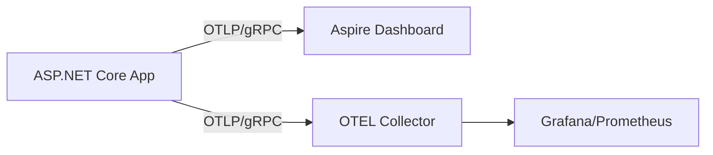

# .NET Aspire Observability: From Zero-Config Magic to OpenTelemetry Protocols

## Introduction

In the world of modern distributed systems, observability is no longer a "nice-to-have" — it's a fundamental requirement for building robust, reliable, and maintainable applications. However, setting up a comprehensive observability stack (logs, metrics, and traces) has historically been a complex and time-consuming endeavor.

Enter **.NET Aspire**.

While much of the early hype around .NET Aspire focused on its developer-friendly orchestration, one of its most powerful — and perhaps under-appreciated — features is how it elevates observability to a first-class citizen. In this deep dive, we'll go beyond the surface-level "magic" of the dashboard and explore the underlying OpenTelemetry protocols and .NET runtime diagnostics that make it all work.

We'll peel back the layers to see how Aspire bridges the gap between zero-config local development and industrial-strength production observability.

## 1. The "Magic" of Zero-Config Observability

If you've ever scaffolded a new .NET Aspire project, you've likely seen this innocent-looking line in your `Program.cs`:

```csharp
builder.AddServiceDefaults();
```

Behind this single extension method lies an entire world of pre-configured observability. When you run your Aspire application, the **Aspire Dashboard** automatically populates with:

-   **Structured Logs**: No more grepping through console output.
-   **Distributed Traces**: See how a request travels from your frontend to backend APIs and databases.
-   **Metrics**: Real-time performance counters (CPU, memory, request rates) visualized in the browser.

The immediate payoff is incredible. Within minutes, you have a better observability setup than many systems that have been in production for years. But for a Senior Developer or Architect, "magic" is often a word that triggers a healthy skepticism. To truly trust and extend this system, we need to understand the underlying mechanics.

## 2. Peeling Back the Layers: The OTLP Protocol

At its core, .NET Aspire is not reinventing observability. Instead, it is a world-class implementation of the **OpenTelemetry (OTel)** standard.

When your application is running, it generates telemetry data in the **OTLP (OpenTelemetry Line Protocol)** format. But where does this data go?

In your local development environment, the **Aspire Dashboard acts as an OTLP endpoint**. Your services are automatically configured to send their traces, logs, and metrics to this dashboard via OTLP over gRPC.

### The Role of Environment Variables

This integration is driven by standard OTel environment variables that Aspire injects during service startup. Two of the most critical are:

-   `OTEL_EXPORTER_OTLP_ENDPOINT`: Tells the app where to send its data (e.g., `http://localhost:18889`).
-   `OTEL_SERVICE_NAME`: Ensures your service is correctly identified in the dashboard.

### Visualizing the Flow

To understand the architecture, it's helpful to see how data flows from your application to its final destination:



In your local environment, the flow is simplified directly to the Dashboard. However, the exact same OTLP-based approach is what allows you to seamlessly transition to a production-grade collector (like the OpenTelemetry Collector) without changing a single line of application code.

## 3. The Engine Room: Microsoft.Extensions.Diagnostics

The secret to .NET Aspire's observability is its tight integration with the **Microsoft.Extensions.Diagnostics** ecosystem.

Behind the scenes, Aspire is not implementing its own custom tracing or metrics engine. Instead, it is a highly opinionated and well-configured wrapper around standard .NET primitives.

### ActivitySource and Meter

Aspire's distributed tracing is built on `ActivitySource`, and its metrics are built on `Meter`. These are the standard .NET types that provide the backbone for OTel instrumentation.

When you call `AddServiceDefaults()`, Aspire performs several critical tasks:

-   Configures OTLP exporters for traces and metrics.
-   Applies **Semantic Conventions**: It ensures that standard tags like `http.method` and `http.route` are consistent across your entire distributed system.
-   Registers default listeners for commonly used libraries, such as `HttpClient`, `SqlClient`, and Entity Framework Core.

By using standard .NET diagnostics, Aspire ensures that any library already compatible with OpenTelemetry will "just work" when plugged into an Aspire-based system.

## 4. Extending the Magic: Custom Instrumentation

While Aspire's default instrumentation is impressive, the real power lies in how easy it is to add your own custom telemetry. Because Aspire uses standard .NET primitives, you don't need any Aspire-specific knowledge to instrument your business logic.

### Adding a Custom Counter

Let's say you want to track how many times a particular business event occurs, such as an order being placed. You can do this with just a few lines of standard .NET code:

```csharp
public class OrderService
{
    private static readonly Meter OrderMeter = new("MyCompany.OrderService");
    private static readonly Counter<int> OrdersPlacedCounter = OrderMeter.CreateCounter<int>("orders.placed");

    public void PlaceOrder(string region)
    {
        // Business logic...
        OrdersPlacedCounter.Add(1, new TagList { { "region", region } });
    }
}
```

Because Aspire's observability is built on standard `Meter` and `Counter` types, this custom metric will **automatically show up in the Aspire Dashboard's Metrics tab**. You can then filter and visualize this data alongside your system-level metrics, giving you a holistic view of both your system's health and its business performance.
