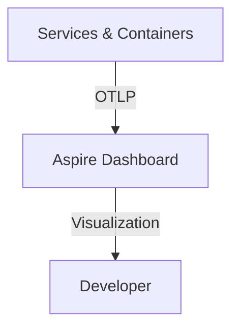

# .NET Aspire: The Complete Tour

## Introduction

In the world of modern cloud-native development, we've become accustomed to a certain level of complexity. Building, debugging, and orchestrating a distributed system — even locally — often feels like managing a fleet of unruly containers through a dense fog of YAML.

We've been told that microservices are the answer, but the "Black Box" problem remains. How do we see what's happening across service boundaries? How do we manage service discovery without hardcoding IP addresses? And why does it feel like we're spending more time on infrastructure plumbing than on business logic?

Enter **.NET Aspire**.

It's not just a new tool; it's a paradigm shift in the .NET ecosystem. It's a highly opinionated, cloud-native stack designed to turn the chaos of distributed systems into a cohesive, developer-friendly experience. In this tour, we'll journey from the depths of "YAML Hell" to the "Hero Moment" of zero-config observability.

## Setting the Scene: The YAML Shadow Realm

If you're a Senior Developer or Architect, your daily struggle likely involves a `docker-compose.yml` file that has grown into a thousand-line monster. You're juggling brittle port mappings, environment variables that need to be manually synced across five different projects, and a local environment that feels nothing like production.

When something goes wrong, you're left grepping through disconnected console logs, trying to reconstruct a single request's path through your system. This is the **YAML Shadow Realm** — a place where productivity goes to die, and "it works on my machine" is a desperate plea for help.

.NET Aspire was built to lead us out of this shadow.

## Enter the Hero: .NET Aspire & The AppHost

If we're leaving YAML behind, where are we going?

The answer is **C#**.

.NET Aspire replaces the orchestrator with code. When you add .NET Aspire to your solution, it introduces two foundational projects:

- **The AppHost (`*.AppHost`)**: This is the "brain" of your application. It defines your resource graph — services, databases, Redis caches, and more — using a fluent C# API. It's type-safe, version-controlled, and gives you all the power of IntelliSense.
- **ServiceDefaults (`*.ServiceDefaults`)**: This is the "backbone." It's a shared project that configures OpenTelemetry, health checks, and resiliency (Polly) across your entire solution in a single method call: `builder.AddServiceDefaults()`.

By moving orchestration into C#, .NET Aspire turns your distributed system from a loosely connected set of projects into a cohesive unit that understands its own architecture.

## Bringing the Legacy: Integration Blueprint

One of the biggest misconceptions about .NET Aspire is that it's only for new projects. In fact, it's remarkably non-invasive. You can pull an existing solution into the Aspire orbit without rewrites.

The "Integration Blueprint" is straightforward:

1.  **Add the AppHost**: Create a new project using the `aspire-apphost` template.
2.  **Add project references**: Reference your existing Web API or Frontend from the AppHost.
3.  **Define the relationship**: Use the AppHost's fluent API to orchestrate your legacy services.

### The Orchestration Code

Here's how that looks in your AppHost's `Program.cs`:

```csharp
var builder = DistributedApplication.CreateBuilder(args);

// Register your existing projects
var api = builder.AddProject<Projects.MyExisting_Api>("apiservice");

builder.AddProject<Projects.MyExisting_Web>("webfrontend")
       .WithReference(api); // Automatically handles service discovery

builder.Build().Run();
```

Notice that `.WithReference(api)`? That single line is doing something profound. It's handling **Service Discovery** for you. Your web frontend can now call the API using the logical name `http://apiservice` instead of a hardcoded URL or a fragile environment variable. Aspire handles the mapping at runtime, locally and in the cloud.

## The Hero Moment: The All-Seeing Dashboard

The climax of our tour is the moment you run the AppHost project.

When you do, .NET Aspire launches its **Developer Dashboard**. It's not just a UI; it's the mission control for your distributed system. Without writing a single line of telemetry code, your dashboard is populated with:

- **Distributed Traces**: Visualize the flow of requests across your service boundaries.
- **Structured Logs**: View and filter logs from all orchestrated projects in a single view.
- **Metrics**: Real-time performance counters (CPU, memory, request rates) visualized in the browser.

This is made possible by .NET Aspire's use of **OpenTelemetry (OTel)** and the **OTLP (OpenTelemetry Line Protocol)**. Your services are automatically configured to send their data to the dashboard, which acts as a local collector.



It's the "Hero Moment" because it instantly provides the observability that used to take days of configuration and complex setup to achieve.

## Scaling Up: Resiliency and the Cloud

Observability is only half the battle. .NET Aspire also improves production readiness with built-in **Resiliency Patterns**.

By including the `ServiceDefaults` project, your services automatically benefit from standard resiliency patterns like retries and circuit breakers (powered by **Polly**). This ensures that your system remains stable even when distributed calls fail.

And when you're ready to go live, .NET Aspire's tight integration with the **Azure Developer CLI (`azd`)** ensures a seamless transition. With a few commands, your AppHost resource graph is converted into cloud-native infrastructure on Azure Container Apps, with all your logs and traces redirected to Azure Monitor or Managed Grafana.

## Conclusion

.NET Aspire is more than just a convenient way to run your microservices locally. It is a paradigm shift in how we build, debug, and ship cloud-native applications.

By replacing YAML with C# orchestration, automating service discovery, and elevating observability to a first-class citizen, .NET Aspire empowers developers to focus on what matters most: delivering value. It transforms the "black box" of distributed systems into a transparent, resilient, and developer-friendly experience.

If you haven't yet, I encourage you to take the tour yourself. Pull an existing solution into an Aspire AppHost, run it, and experience the "Hero Moment" of seeing your entire system come to life in the Dashboard.

---

**What's your biggest hurdle in modern cloud-native development?** Does .NET Aspire look like the answer you've been waiting for? Let me know in the comments below!
