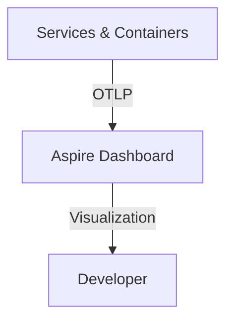

# .NET Aspire: The Complete Tour Implementation Plan

> **For agentic workers:** REQUIRED: Use superpowers:subagent-driven-development (if subagents available) or superpowers:executing-plans to implement this plan. Steps use checkbox (`- [ ]`) syntax for tracking.

**Goal:** Author and publish a comprehensive, narrative-driven technical blog post for Senior Developers and Architects exploring .NET Aspire from its core vision to production deployment.

**Architecture:** A narrative deep dive that transitions from the pain points of microservices development to the "hero moment" of zero-config observability in the Aspire Dashboard.

**Tech Stack:** Jekyll (Liquid/Markdown), .NET Aspire (Reference).

---

### Task 1: Scaffolding and Introduction

**Files:**
- Create: `_posts/2026-03-17-aspire-the-complete-tour.md`

- [x] **Step 1: Create the post file with initial front matter**

```markdown
---
layout: post
title: ".NET Aspire: The Complete Tour — From YAML Hell to Hero Observability"
feature-img: 'assets/img/feature-img/circuit.jpeg'
thumbnail: 'assets/img/thumbnails/feature-img/circuit.jpeg'
tags: [Aspire, .NET, Cloud-Native, DX, Architecture]
---

# .NET Aspire: The Complete Tour

## Setting the Scene: The YAML Shadow Realm
...
```

- [x] **Step 2: Write the "Introduction" and "YAML Shadow Realm" section**
Establish the "black box" problem and the developer's struggle with traditional microservices local environments.

- [x] **Step 3: Commit**

```bash
git add _posts/2026-03-17-aspire-the-complete-tour.md
git commit -m "chore: scaffold Aspire complete tour post"
```

---

### Task 2: Section 2 & 3 - The Hero and Integration

**Files:**
- Modify: `_posts/2026-03-17-aspire-the-complete-tour.md`

- [x] **Step 1: Write "Enter the Hero: .NET Aspire & The AppHost" section**
Explain the role of the `AppHost` as the orchestrator and the `ServiceDefaults` as the backbone.

- [x] **Step 2: Write "Bringing the Legacy: Integration Blueprint" section**
Provide the step-by-step walk-through of pulling existing projects into an Aspire solution.

- [x] **Step 3: Add code snippets for orchestration**

```csharp
var builder = DistributedApplication.CreateBuilder(args);
var api = builder.AddProject<Projects.MyApi>("api");
builder.AddProject<Projects.MyWeb>("web")
       .WithReference(api);
builder.Build().Run();
```

- [x] **Step 4: Commit**

```bash
git commit -am "feat: add hero and integration sections"
```

---

### Task 3: Section 4 & 5 - The Dashboard and Scaling

**Files:**
- Modify: `_posts/2026-03-17-aspire-the-complete-tour.md`

- [x] **Step 1: Write "The Hero Moment: The All-Seeing Dashboard" section (Climax)**
Highlight zero-config OTLP observability, distributed traces, and metrics.

- [x] **Step 2: Add Mermaid diagram for OTLP observability**



- [x] **Step 3: Write "Scaling Up: Resiliency and the Cloud" section**
Briefly cover Polly-based resiliency and `azd` deployment.

- [x] **Step 4: Commit**

```bash
git commit -am "feat: add dashboard and scaling sections"
```

---

### Task 4: Conclusion and Final Polish

**Files:**
- Modify: `_posts/2026-03-17-aspire-the-complete-tour.md`

- [x] **Step 1: Write the Conclusion**
Final thoughts on the DX paradigm shift that .NET Aspire represents.

- [x] **Step 2: Final review and formatting check**
Verify Jekyll front matter and code highlighting.

- [x] **Step 3: Commit and finalize**

```bash
git commit -am "feat: complete Aspire complete tour post"
```
