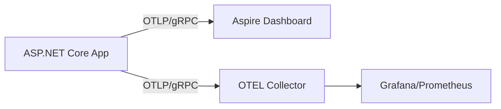

# .NET Aspire Observability Deep Dive Implementation Plan

> **For agentic workers:** REQUIRED: Use superpowers:subagent-driven-development (if subagents available) or superpowers:executing-plans to implement this plan. Steps use checkbox (`- [ ]`) syntax for tracking.

**Goal:** Author and publish a high-quality technical blog post exploring .NET Aspire's observability internals for a Senior Developer/Architect audience.

**Architecture:** A hybrid deep dive post that balances hands-on C# code with high-level architectural analysis of OTLP and .NET diagnostics.

**Tech Stack:** Jekyll (Liquid/Markdown), .NET Aspire (Reference), OpenTelemetry (Reference).

---

### Task 1: Scaffolding and Front Matter

**Files:**
- Create: `_posts/2026-03-17-aspire-observability-deep-dive.md`

- [ ] **Step 1: Create the post file with initial front matter**

```markdown
---
layout: post
title: ".NET Aspire Observability: From Zero-Config Magic to OpenTelemetry Protocols"
feature-img: 'assets/img/feature-img/circuit.jpeg'
thumbnail: 'assets/img/thumbnails/feature-img/circuit.jpeg'
tags: [Aspire, .NET, OpenTelemetry, Observability, Architecture]
---

# .NET Aspire Observability: From Zero-Config Magic to OpenTelemetry Protocols

## Introduction
...
```

- [ ] **Step 2: Run Jekyll locally to verify the post is visible**

Run: `bundle exec jekyll serve`
Expected: Post appears at `http://localhost:4000/blog/2026/03/17/aspire-observability-deep-dive/` (or similar URL).

- [ ] **Step 3: Commit**

```bash
git add _posts/2026-03-17-aspire-observability-deep-dive.md
git commit -m "chore: scaffold Aspire observability post"
```

---

### Task 2: Section 1 & 2 - The Magic and OTLP

**Files:**
- Modify: `_posts/2026-03-17-aspire-observability-deep-dive.md`

- [ ] **Step 1: Write "The Magic of Zero-Config" section**
Include a code snippet of `AddServiceDefaults()` and describe the developer experience.

- [ ] **Step 2: Write "Peeling Back the Layers: The OTLP Protocol" section**
Explain the role of the Aspire Dashboard as an OTLP endpoint and the environment variables involved.

- [ ] **Step 3: Add Mermaid diagram for the OTLP flow**



- [ ] **Step 4: Verify rendering**

Check browser for Mermaid diagram and text clarity.

- [ ] **Step 5: Commit**

```bash
git commit -am "feat: add magic and OTLP sections"
```

---

### Task 3: Section 3 & 4 - Internals and Extension

**Files:**
- Modify: `_posts/2026-03-17-aspire-observability-deep-dive.md`

- [ ] **Step 1: Write "The Engine Room: Microsoft.Extensions.Diagnostics" section**
Deep dive into `ActivitySource` and `Meter` usage within the Aspire SDK.

- [ ] **Step 2: Write "Extending the Magic" section with code sample**
Add a code snippet showing a custom `Counter` or `Histogram`.

```csharp
var meter = new Meter("MyCustomService");
var counter = meter.CreateCounter<int>("orders.placed");
// ... later in code
counter.Add(1, new TagList { { "region", "eu-west-1" } });
```

- [ ] **Step 3: Verify code highlighting**

Check browser to ensure C# snippets are highlighted correctly.

- [ ] **Step 4: Commit**

```bash
git commit -am "feat: add internals and custom instrumentation sections"
```

---

### Task 4: Section 5 & Conclusion - Production and Wrap-up

**Files:**
- Modify: `_posts/2026-03-17-aspire-observability-deep-dive.md`

- [ ] **Step 1: Write "Transitioning to Production" section**
Discuss `azd deploy` and scaling to Azure Monitor/Managed Grafana.

- [ ] **Step 2: Write Conclusion and final polish**
Summarize the key takeaways and encourage feedback.

- [ ] **Step 3: Run final spellcheck and formatting check**

- [ ] **Step 4: Commit and finalize**

```bash
git commit -am "feat: complete Aspire observability post"
```
